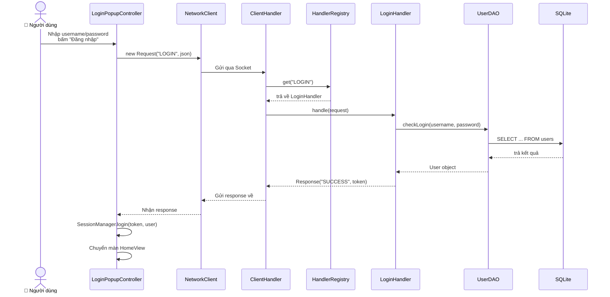
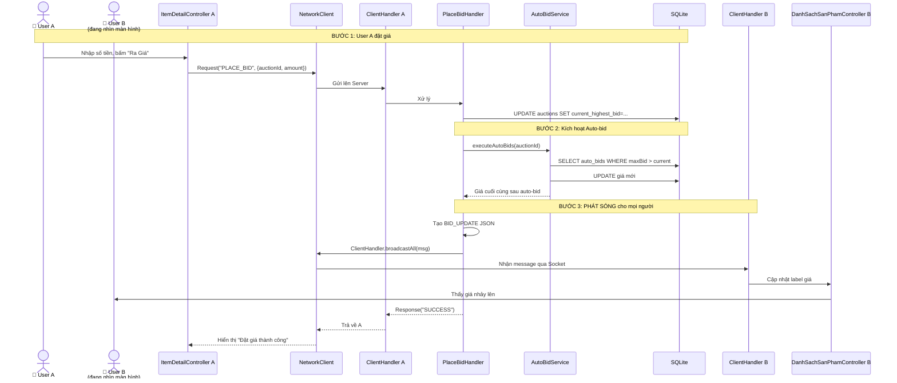
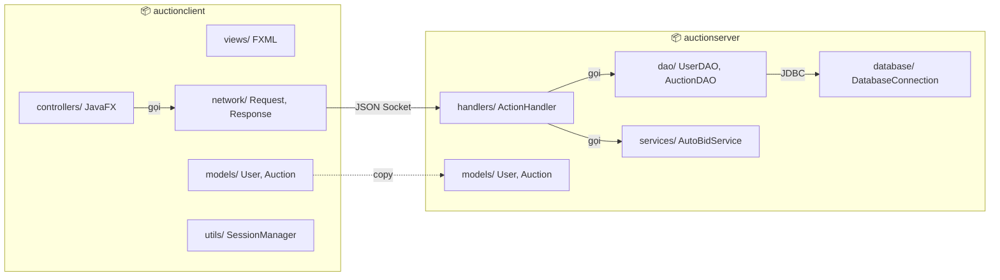
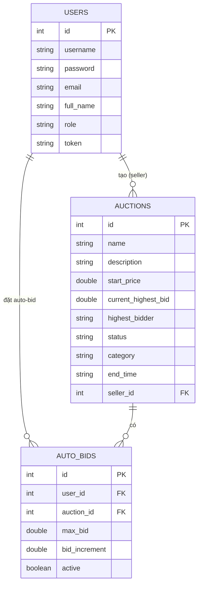

# 📐 Sơ đồ Kiến trúc Hệ thống Đấu giá

> Sơ đồ đơn giản, chia nhóm rõ ràng, không rối mắt.

---

## 1. 🏗️ Tổng quan Client – Server – Database

```mermaid
graph TB
    subgraph CLIENT["💻 CLIENT (JavaFX App)"]
        UI["🖼️ Giao diện (FXML + Controller)"]
        NET["📡 NetworkClient<br/>Singleton gửi/nhận"]
        SES["🔐 SessionManager<br/>Lưu token, username"]
    end

    subgraph SERVER["🖥️ SERVER (Java Socket)"]
        MAIN["ServerMain<br/>Port 8888"]
        CH["ClientHandler<br/>1 thread / client"]
        REG["HandlerRegistry<br/>Bảng phân công"]
        HD[(Handlers<br/>Login, PlaceBid, AddProduct...)]
        SVC[(Services<br/>AutoBidService)]
    end

    subgraph DB["🗄️ DATABASE (SQLite)"]
        T1["users"]
        T2["auctions"]
        T3["auto_bids"]
    end

    UI -->|click "Ra giá"| NET
    NET -->|Socket<br/>Request JSON| MAIN
    MAIN -->|accept| CH
    CH --> REG
    REG --> HD
    HD --> SVC
    HD -->|SQL| T1
    HD -->|SQL| T2
    HD -->|SQL| T3
    CH -->|Response JSON| NET
    NET -->|update label| UI
    NET -.->|lưu token| SES
```

**Giải thích ngắn:**
- **CLIENT**: Người dùng bấm nút → Controller gọi `NetworkClient` gửi JSON qua Socket.
- **SERVER**: `ServerMain` lắng nghe cổng 8888. Mỗi client kết nối → tạo 1 `ClientHandler` chạy riêng. `HandlerRegistry` tìm đúng Handler xử lý.
- **DB**: SQLite 3 bảng chính. Handler gọi DAO để đọc/ghi.

---

## 2. 🔄 Luồng xử lý 1 Request (ví dụ: Đăng nhập)



---

## 3. ⚡ Luồng Đặt giá + Auto-bid + Real-time Broadcast



---

## 4. 📦 Cấu trúc Package (tầng)



**3 tầng chính:**
1. **Presentation** (`views` + `controllers`) → Người dùng tương tác
2. **Network** (`network`) → Cầu nối Client–Server bằng JSON qua Socket
3. **Business + Data** (`handlers`, `services`, `dao`) → Xử lý logic + ghi DB

---

## 5. 🎯 Các Handler chính (Bảng tra nhanh)

| Handler | Action | Nhiệm vụ |
|---------|--------|----------|
| `LoginHandler` | `LOGIN` | Kiểm tra user, tạo token |
| `RegisterHandler` | `REGISTER` | Tạo tài khoản mới |
| `PlaceBidHandler` | `PLACE_BID` | Đặt giá + kích hoạt auto-bid + broadcast |
| `SetAutoBidHandler` | `SET_AUTO_BID` | Lưu cấu hình auto-bid |
| `AddProductHandler` | `ADD_PRODUCT` | Seller tạo sản phẩm mới |
| `UpdateProductHandler` | `UPDATE_PRODUCT` | Seller sửa sản phẩm |
| `DeleteProductHandler` | `DELETE_PRODUCT` | Seller xóa sản phẩm |
| `DeleteUserHandler` | `DELETE_USER` | Admin xóa tài khoản |
| `GetAllAuctionsHandler` | `GET_ALL_AUCTIONS` | Lấy danh sách tất cả đấu giá |
| `GetAuctionsByCategoryHandler` | `GET_AUCTIONS_BY_CATEGORY` | Lọc theo danh mục |
| `GetAuctionByIdHandler` | `GET_AUCTION_BY_ID` | Lấy chi tiết 1 sản phẩm |
| `GetMyAuctionsHandler` | `GET_MY_AUCTIONS` | Seller xem sản phẩm của mình |

---

## 6. 🗃️ Sơ đồ Database (3 bảng chính)



---

*File này dùng Mermaid syntax. Bạn có thể xem trực tiếp trong GitHub, VS Code (plugin Mermaid), hoặc [mermaid.live](https://mermaid.live).*
